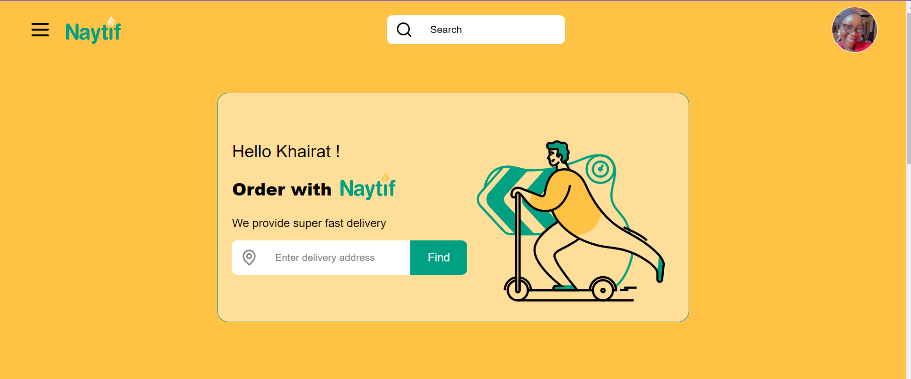
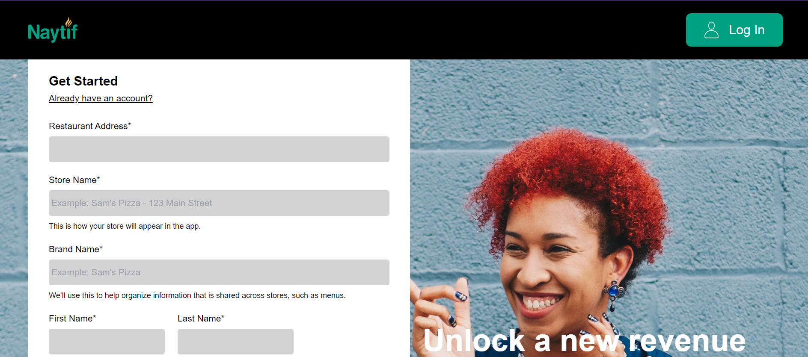
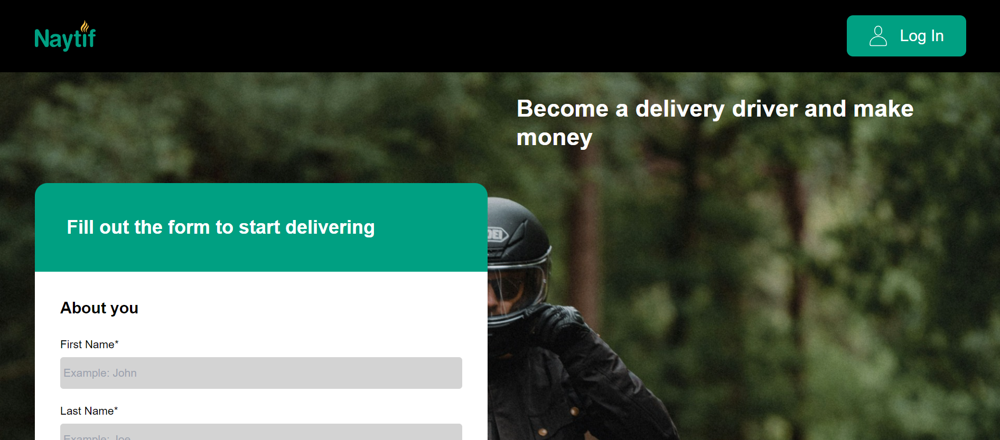

  

<h1 align="center">Naytif - Frontend</h1>

  

## Introduction

Welcome to Naytif's frontend directory. **[Naytif](https://naytif.vercel.app/)** is a food delivery web application that allows individuals within Nigeria to have access to indigenous cuisines from various restaurants. Naytif enables its users to place orders for their favorite menu items from the comfort of their homes.

## Features

### **[For Users](https://naytif.vercel.app/)**:

  

#### User Authentication:

- Allow users to create accounts, log in, and log out securely.
- Implement authentication mechanisms such as email/password, OAuth, or social login.

#### Menu Browsing and Ordering:

- Display a variety of indigenous cuisines from various restaurants.
- Enable users to browse menus, view dish details, and add items to their cart.

#### Order Management:

- Provide users with the ability to view and manage their orders.

#### Payment Processing:

- The website only supports payment on delivery at this point in time.

### **[For Restaurants](https://naytif.vercel.app/auth/restuarants/sign_up)**:

  

#### Restaurant Registration:

- Allow restaurants to register accounts and manage their profiles.
- Enable restaurants to add, update, and remove menu items.

#### Order Management:

- Provide restaurants with tools to manage incoming orders.
- Allow restaurants to update order status and notify users about order preparation and delivery.

### **[For Riders](https://naytif.vercel.app/auth/rider/sign_up)**:

  

#### Rider Registration and Scheduling:

- Allow riders to register accounts and set their availability for delivery shifts.

## Technologies Used

### Frontend Frameworks and Libraries:

- [React](https://reactjs.org/)
- [Tailwind CSS](https://tailwindcss.com/)

### Other Technologies:

- Vite (for build tooling)
- Figma (for design template)

## Getting Started

### Prerequisites

- Node.js (version >= 12.0.0)
- npm or yarn
- Git

### Installation

- Clone the repository:
  `git clone https://github.com/khairatAA/Naytif.git`

- Navigate to the frontend directory:
  `cd Naytif/frontend`

- Install dependencies:
  `npm install`

### Running the Application

- Start the development server:
  `npm start`

- Access the application at `http://localhost:3000` by default.

## Design Stage

Before the coding process, a design template was created using **[Figma](https://www.figma.com/)** to visualize our vision for our food delivery application. You can view the design template **[here](https://www.figma.com/file/Wbm8hiC5NDMXhCRMImbQcd/Naytiv?type=design&node-id=0%3A1&mode=design&t=CKv3LBsVEwVq9l8d-1)**.

## Usage

### Basic Usage Instructions

- Navigate through the **[application](https://naytif.vercel.app/)** using the navigation bar at the top.

- Explore different sections, such as browsing menus, placing orders, and tracking deliveries.

## Contributing

Please read the **[Contributing instructions](../CONTRIBUTING.md)**

## License

This project is licensed under the _MIT License_ - see the **[LICENSE](../LICENSE)** file for details.

## Contributors

- Khairat Adesina [khairatadesina01@gmail.com](mailto:khairatadesina01@gmail.com) [LinkedIn](https://www.linkedin.com/in/khairat-adesina1234/) [X](https://twitter.com/_dedamola)

- Omar Jammeh [Orms45@gmail.com](mailto:Orms45@gmail.com) [LinkedIn](http://www.linkedin.com/in/omar-jammeh-a4b0b029a) [X]()
